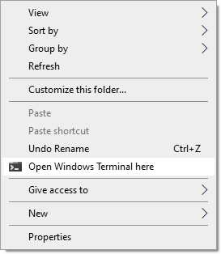

# Windows Terminal CM
A File Explorer Context Menu Integration.

## Purpose

Add a custom context menu when you right click inside your File Explorer in Windows to allow an easy access to the [Windows Terminal](https://github.com/microsoft/terminal). The Windows Terminal will be opened within the current or selected directory.

## How to use

- Download the `src` folder and keep the structure inside.
- Launch `src/Install.bat` for the installation.
- Launch `src/Uninstall.bat` for the uninstallation.

## License

Feel free to do whatever you want. The project is released under the [MIT](./LICENSE.md) license.